# QUOTAS ⚙️🔐

**QU**antum-safe **OT** **A**ssessment **S**andbox


## 📑 Table of Contents

- [🌐 Live Interactive Dashboard](#-live-interactive-dashboard)
- [📖 Overview](#-overview)
- [🏗️ Why Test at the VPN Gateway Stage?](#%EF%B8%8F-why-test-at-the-vpn-gateway-stage)
- [🔬 The 72,000-Point Experimental Matrix](#-the-72000-point-experimental-matrix)
- [🔐 Detailed Cryptographic Suites](#-detailed-cryptographic-suites)
- [🏭 OpenPLC v4 Runtime Architecture (Golden PLC)](#-openplc-v4-runtime-architecture-golden-plc)
- [📊 Comprehensive Visual Results & Key Findings](#-comprehensive-visual-results--key-findings)
- [📂 Directory Structure](#-directory-structure)
- [🛠️ Reproduction & Setup](#️-reproduction--setup)
- [🤝 Credits & Attributions](#-credits--attributions)

---

## 🌐 Live Interactive Dashboard

To accurately visualize the routing, encapsulation, and real-time physics of this testbed, we have deployed an interactive Single-Page Application (SPA) dashboard, proudly made by Claude.

🚀 **[View the Live QUOTAS Dashboard Here](https://psaisurya.github.io/QUOTAS/)**

> **Data Architecture Note:** The live simulation does not rely on mocked data. The interactive visualization **dashboard** leverages a native JavaScript data wrapper (`data.js`) to parse the actual **72,000-packet empirical benchmark CSV** generated by this sandbox.
> 
> **Topology Note:** The live dashboard visualizes a full 5-Layer Purdue topology for architectural context. Nodes with dashed borders (e.g., Historian, Field RTU) are structural representations, while the animated telemetry traces the exact 4-node Docker benchmark harness utilized in this study (HMI ➔ Corp VPN ➔ Plant VPN ➔ Golden PLC).

---

## 📖 Overview

As the world migrates to NIST-standardized Post-Quantum Cryptography (FIPS 203, 204, 205), Industrial Control Systems (ICS) face a unique threat: **Cryptographic Starvation**. Edge devices like RTUs and PLCs operate under severe compute constraints, making them highly susceptible to CPU exhaustion during complex lattice-based handshakes.

**QUOTAS** provides a fully automated, Dockerized testbed to measure the exact latency, jitter, and Denial-of-Service (DoS) thresholds of **Modbus TCP, S7comm, and OPC UA** when routed through Quantum-Safe VPN tunnels under highly constrained CPU limits.

---

## 🏗️ Why Test at the VPN Gateway Stage?

In real-world Operational Technology (OT) environments, legacy PLCs and RTUs fundamentally lack the CPU power, memory, and software support to natively execute heavy cryptographic stacks. Upgrading every physical controller in a manufacturing plant is financially impossible.

Instead, the industry standard is to use "bump-in-the-wire" **VPN Gateways or DMZ Firewalls** to encapsulate raw industrial traffic over untrusted networks. In our architecture, the **Corporate VPN Gateway** and **Plant VPN Gateway** act as cryptographic proxies. Therefore, testing this proxy architecture within a heavily constrained edge environment answers the critical question: _Will the massive compute tax of the gateway's Post-Quantum cryptography starve the legacy PLC sharing the cabinet's limited resources?_

---

## 🔬 The 72,000-Point Experimental Matrix

The framework programmatically iterates through a strict test matrix to discover hardware breaking points. The **72,000 data points** represent an exhaustive combination of variables, calculated exactly as follows:

**3 Protocols** $\times$ **4 CPU Profiles** $\times$ **6 Cryptographic Suites** $\times$ **1,000 Polling Iterations** = **72,000 Telemetry Packets.**

### Hardware Constraints (Linux CFS CPU Profiles)

To accurately simulate an aging, low-power ICS cabinet, the dynamic Docker hypervisor limits artificially choke the **entire Plant Edge environment**. The CPU limit is applied simultaneously to **BOTH** the Plant VPN Gateway (which executes the heavy Post-Quantum lattice mathematics) and the Golden PLC (which parses the incoming industrial protocols). 

By starving the entire plant edge as a single cohesive unit, we can measure how the cryptographic overhead of the gateway compounds with the protocol parsing overhead of the legacy PLC. These limits are configured as percentages of a single core of an Intel® Core™ i9-14900K.

_(**Note:** Due to Docker Desktop and Windows Subsystem for Linux (WSL) abstraction layers, strict hardware-level isolation targeting specific Performance (P-cores) or Efficient (E-cores) cannot be strictly guaranteed or verified)._

- **Micro RTU (0.01 CPU Limit / 1%):** Simulates battery-powered, highly constrained telemetry edge units.
- **Legacy RTU (0.1 CPU Limit / 10%):** Represents decade-old, low-power industrial controllers.
- **Mid-Tier PLC (0.5 CPU Limit / 50%):** Represents standard modern automation equipment.
- **High-End PLC (1.5 CPU Limit / 150%):** Represents advanced, multi-core automation controllers.

---

## 🔐 Detailed Cryptographic Suites

Establishing a secure VPN tunnel requires two steps: **Authentication** (proving who you are using Digital Signatures) and **Key Exchange** (safely agreeing on a shared secret password to encrypt the data).

The 6 suites tested in this sandbox evaluate the new NIST Post-Quantum standards replacing classical RSA and Elliptic Curve cryptography.

_(**Note on Nomenclature**: In `classical cryptography` like RSA, numbers refer to key sizes in bits. In `Post-Quantum Lattice cryptography`, numbers like 44, 65, or 512 refer to the dimensions of the mathematical polynomial matrices used to generate the keys)._

### 1. Classical Baseline (The Control Group)

- **Configuration:** RSA-3072 / X25519
- **Technical Spec:** Uses a traditional 3072-bit prime factorization modulus for Digital Signatures, and a 256-bit Elliptic Curve (Curve25519) for Key Exchange.
- **The ICS Impact:** This represents the current industry standard (~128-bit security). While highly efficient for edge devices, it is entirely vulnerable to future quantum computers running Shor's Algorithm.

### 2. NIST LVL 1 — ML-DSA-44 / ML-KEM-512

- **Configuration:** ML-DSA-44 (Signature) / ML-KEM-512 (Key Encapsulation)
- **Technical Spec:** Matches AES-128 security.
  - **ML-DSA-44:** A Module-Lattice Digital Signature using a $4 \times 4$ polynomial matrix. Public key size: 1,312 bytes. Signature size: 2,420 bytes.
  - **ML-KEM-512:** A Key Encapsulation Mechanism using a $2 \times 2$ matrix of degree-256 polynomials ($2 \times 256 = 512$). Ciphertext size: 768 bytes.
- **The ICS Impact:** While computationally fast, ML-DSA produces huge signatures (~2.4 KB). This taxes network bandwidth heavily in OT environments used to tiny 12-byte Modbus payloads.

### 3. NIST LVL 3 — ML-DSA-65 / ML-KEM-768

- **Configuration:** ML-DSA-65 (Signature) / ML-KEM-768 (Key Encapsulation)
- **Technical Spec:** Matches AES-192 security (The "Medium" tier).
  - **ML-DSA-65:** Uses a larger $6 \times 5$ matrix. Public key size: 1,952 bytes. Signature size: 3,309 bytes.
  - **ML-KEM-768:** Uses a $3 \times 3$ matrix of degree-256 polynomials ($3 \times 256 = 768$). Ciphertext size: 1,088 bytes.
- **The ICS Impact:** Offers a balance between robust future-proof security and manageable processing times, but signature sizes now routinely exceed standard Ethernet limits, guaranteeing packet fragmentation.

### 4. NIST LVL 5 — ML-DSA-87 / ML-KEM-1024

- **Configuration:** ML-DSA-87 (Signature) / ML-KEM-1024 (Key Encapsulation)
- **Technical Spec:** Matches AES-256 security (The "Maximum" paranoia tier).
  - **ML-DSA-87:** Uses an $8 \times 7$ matrix. Public key size: 2,592 bytes. Signature size: 4,627 bytes.
  - **ML-KEM-1024:** Uses a $4 \times 4$ matrix of degree-256 polynomials ($4 \times 256 = 1024$). Ciphertext size: 1,568 bytes.
- **The ICS Impact:** The ML-DSA-87 signature is massive (~4.6 KB). Because standard Ethernet MTU frames can only hold 1.5 KB of data, this algorithm forces the network to fragment the handshake into multiple packets. This severely tests an OT network's ability to handle packet reassembly without dropping TCP connections.

### 5. NIST LVL 1 — FALCON-512 / ML-KEM-512

- **Configuration:** FALCON-512 (Signature) / ML-KEM-512 (Key Encapsulation)
- **Technical Spec:** Matches AES-128 security.
  - **FALCON-512:** A Fast-Fourier Lattice-based signature algorithm operating on polynomials of degree 512. Public key size: 897 bytes. Signature size: 666 bytes.
- **The ICS Impact:** FALCON solves the bandwidth problem—its signatures are tiny (~666 bytes), meaning they fit easily inside a single network packet avoiding fragmentation. However, creating a FALCON signature requires incredibly complex, high-precision floating-point mathematics. This is explicitly tested to see if the math crushes legacy edge CPUs that lack dedicated floating-point units (FPUs).

### 6. NIST LVL 5 — FALCON-1024 / ML-KEM-1024

- **Configuration:** FALCON-1024 (Signature) / ML-KEM-1024 (Key Encapsulation)
- **Technical Spec:** Matches AES-256 security.
  - **FALCON-1024:** Operates on polynomials of degree 1024. Public key size: 1,793 bytes. Signature size: 1,280 bytes.
- **The ICS Impact:** The ultimate stress test. It pairs maximum key encapsulation security with highly compact signature sizes, but demands the absolute highest computational tax on the processor.

---

## 🏭 OpenPLC v4 Runtime Architecture (Golden PLC)

The testbed utilizes a specifically architected OpenPLC v4 C++ runtime acting as the "Golden PLC" at the plant edge. Its internal architecture is configured to expose identical memory registers across multiple protocol stacks simultaneously, ensuring apples-to-apples protocol benchmarking:

- **Siemens S7 Server (x1):** Configured with specific datablocks for direct access by our telemetry script.
- **OPC UA Server (x1):** Configured for anonymous access with node variables directly mapped to the underlying PLC I/O.
- **Modbus TCP Server (x1):** Exposing standard holding registers.
- **Modbus Slave (x1):** Configured for internal fieldbus routing.
- **Control Logic:** A placeholder Ladder Logic (LD) program designed to emulate real PLC functioning. It consists of a simple input-output execution mapping (`Switch_in` → `Light_out`) to guarantee authentic cyclic protocol handling.
- **Custom Python HMI Telemetry Engine:** Custom-built to ensure maximum empirical accuracy. Features strict TPKT/MBAP binary parsing, globally disabled Nagle's Algorithm (`TCP_NODELAY`), and authentic 200ms SCADA polling pacers to prevent artificial OS jitter from contaminating the measurements.

<p align="center">
  <a href="graphs/ladder_logic.png">
    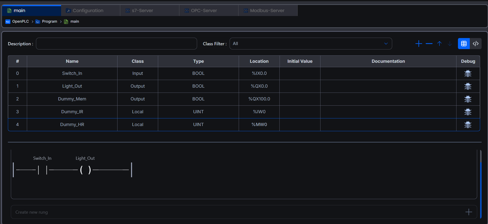
  </a>
</p>

---

## 📊 Comprehensive Visual Results & Key Findings

This testbed yielded four major conclusions regarding Post-Quantum Cryptography in ICS environments. The 72,000 empirical data points have been plotted below to demonstrate the exact physical toll of lattice algorithms on edge hardware.

_(Click on any graph to expand to full resolution)._

### 1. The Cryptographic Starvation Boundary & Predictability

| The Starvation Boundary                                                                                                                                                                                                                                                                                                                        | Tail Latency Predictability                                                                                                                                                                                                                                                                    |
| :--------------------------------------------------------------------------------------------------------------------------------------------------------------------------------------------------------------------------------------------------------------------------------------------------------------------------------------------- | :--------------------------------------------------------------------------------------------------------------------------------------------------------------------------------------------------------------------------------------------------------------------------------------------- |
| <a href="graphs/4_cpu_scaling_boundary.png">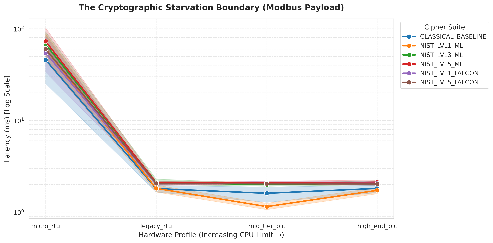</a>                                                                                                                                                                                              | <a href="graphs/5_tail_latency_ecdf.png">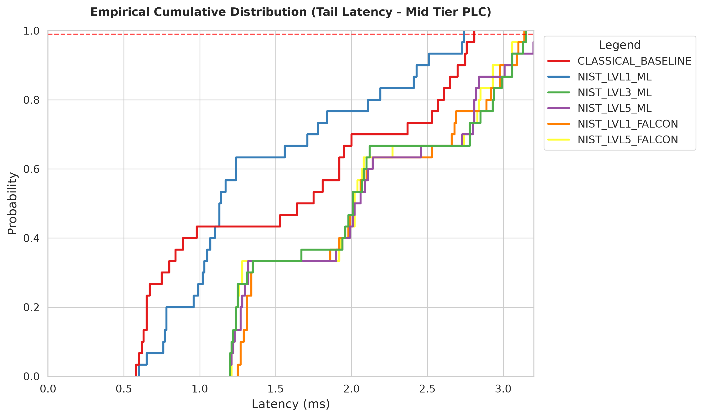</a>                                                                                                                                                          |
| **Plotting latency against available hardware power reveals a severe "Hockey Stick" curve.** At 1% CPU (Micro RTUs), Linux CFS context-switching induces erratic starvation jitter (>80ms). However, scaling hardware to just 10% CPU (Legacy RTUs) flattens the curve, providing enough headroom for a perfectly deterministic ~2ms baseline. | **The ECDF answers the critical industrial question: "What is the absolute maximum delay an actuator will experience 99% of the time?"** Once the 10% CPU starvation boundary is cleared, packet delivery under PQC remains tightly clustered, satisfying strict ICS determinism requirements. |

### 2. Protocol Latency Distributions (PQC Impact by Protocol)

|                                                           Modbus TCP                                                           |                                                       Siemens S7comm                                                       |                                                          OPC UA                                                          |
| :----------------------------------------------------------------------------------------------------------------------------: | :------------------------------------------------------------------------------------------------------------------------: | :----------------------------------------------------------------------------------------------------------------------: |
| <a href="graphs/1_latency_boxplot_modbus.png">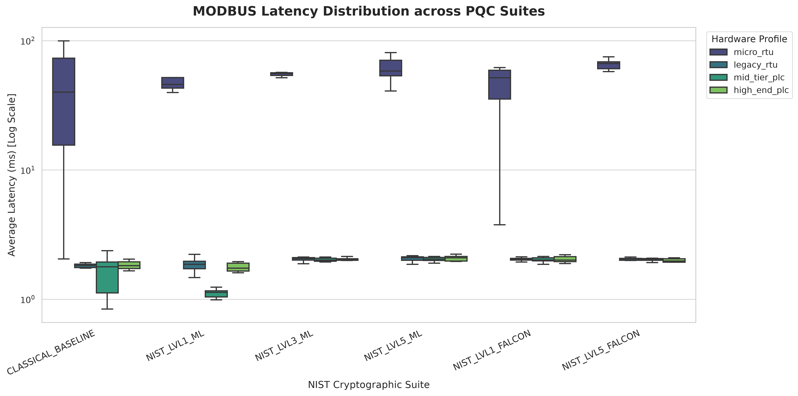</a> | <a href="graphs/1_latency_boxplot_s7.png">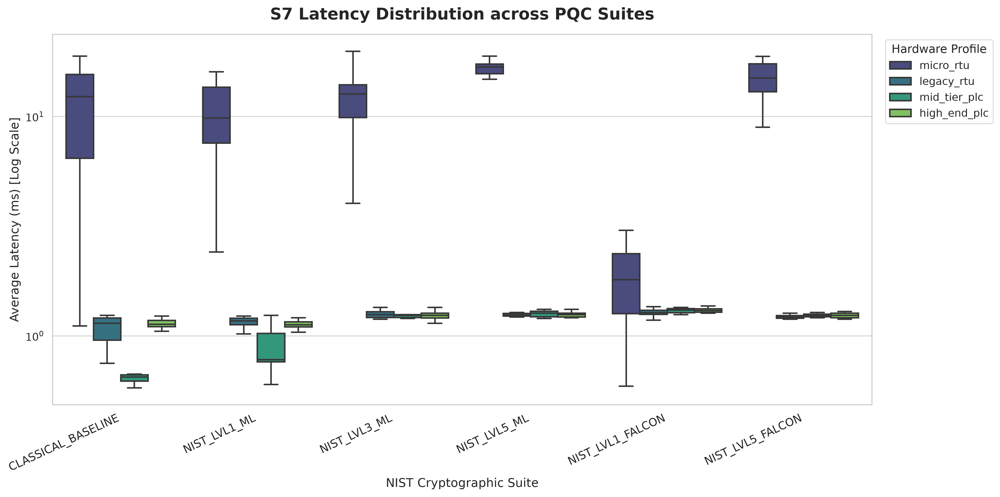</a> | <a href="graphs/1_latency_boxplot_opcua.png">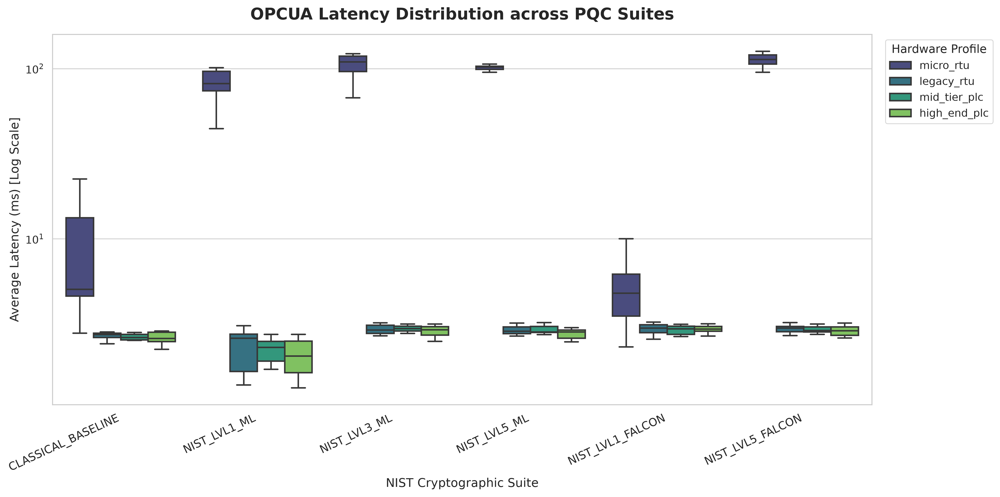</a> |

- **Authentic Protocol Hierarchy:** By comparing the spread of the boxplots across the three protocols, fundamental architectural differences are revealed. **S7comm** (~1.1ms; highly efficient C++ ISO-on-TCP) maintains the tightest clustering and lowest overall latency. **Modbus TCP** (~1.8ms) suffers slightly higher variance due to OS-level kernel interrupts caused by tiny payloads, while **OPC UA** (~2.7ms) exhibits the highest baseline overhead due to complex user-space binary node parsing.

### 3. Cryptographic Overhead by Hardware Profile

|                                                   1% CPU Limit (Micro RTU)                                                    |                                                  10% CPU Limit (Legacy RTU)                                                   |
| :---------------------------------------------------------------------------------------------------------------------------: | :---------------------------------------------------------------------------------------------------------------------------: |
|    <a href="graphs/3_protocol_overhead_micro_rtu.png">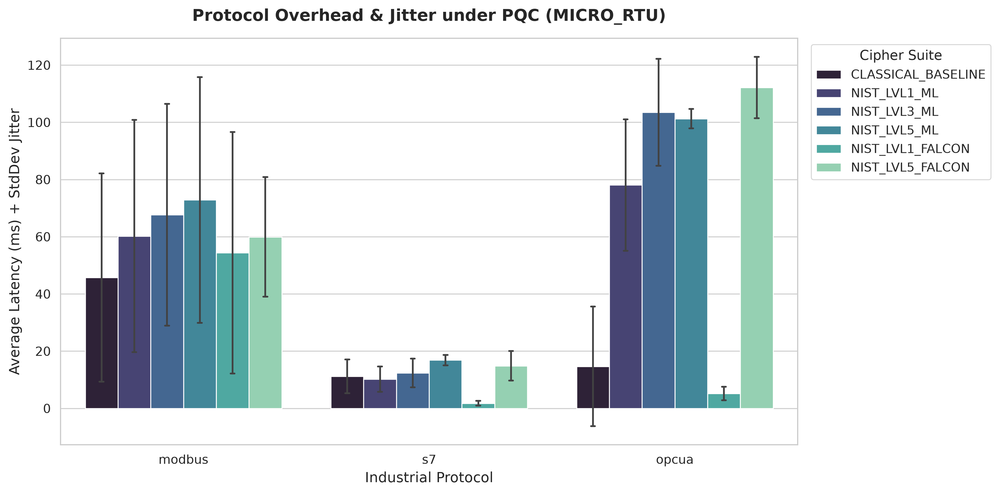</a>    |   <a href="graphs/3_protocol_overhead_legacy_rtu.png">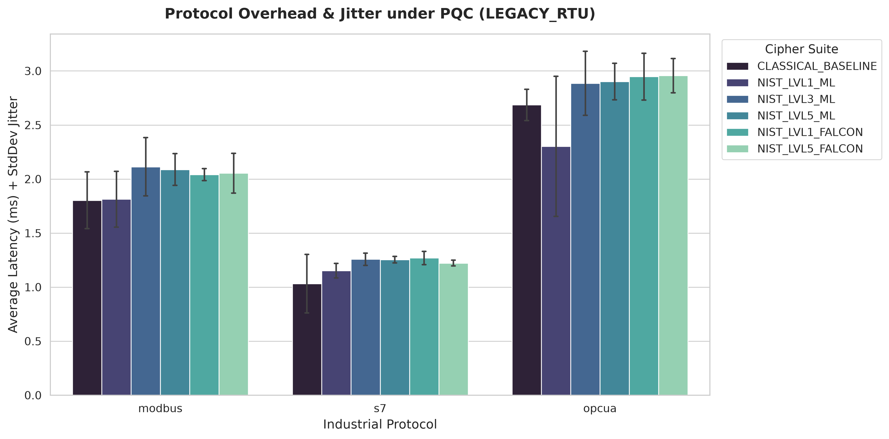</a>   |
|                                               **50% CPU Limit (Mid-Tier PLC)**                                                |                                               **150% CPU Limit (High-End PLC)**                                               |
| <a href="graphs/3_protocol_overhead_mid_tier_plc.png">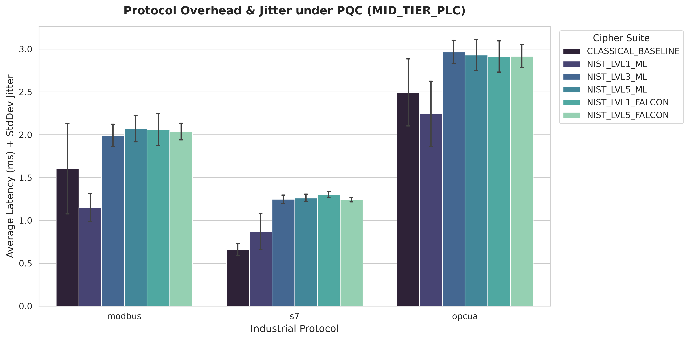</a> | <a href="graphs/3_protocol_overhead_high_end_plc.png">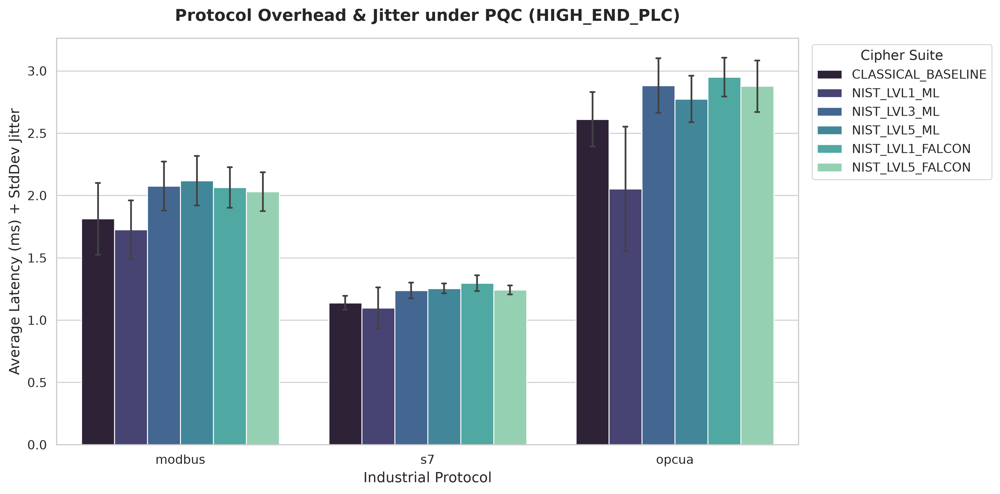</a> |

- **Zero Steady-State Impact:** These grids visually map the overhead of NIST algorithms against the classical baseline. Notice the drastic shift between the Micro RTU and the others: because PQC relies on asymmetric handshakes, the heavy mathematical lifting occurs _exclusively_ during VPN initialization. Once established, steady-state symmetric polling (AES-GCM) under NIST Level 5 is statistically identical to Classical RSA on any hardware above the 10% limit.

### 4. Absolute DoS Resilience

| Hardware Success Rate                                                                                                                                                                                                           | Algorithm Success Heatmap                                                                                                                                                                                                                         |
| :------------------------------------------------------------------------------------------------------------------------------------------------------------------------------------------------------------------------------ | :------------------------------------------------------------------------------------------------------------------------------------------------------------------------------------------------------------------------------------------------ |
| <a href="graphs/2_hardware_success_rate.png">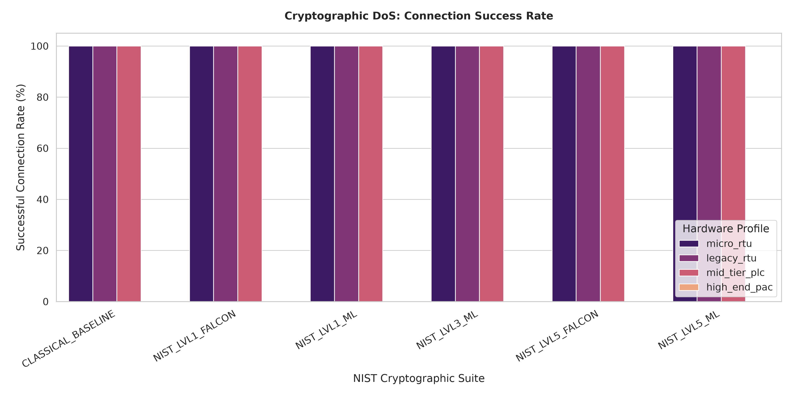</a>                                                                                         | <a href="graphs/2_success_rate_heatmap.png">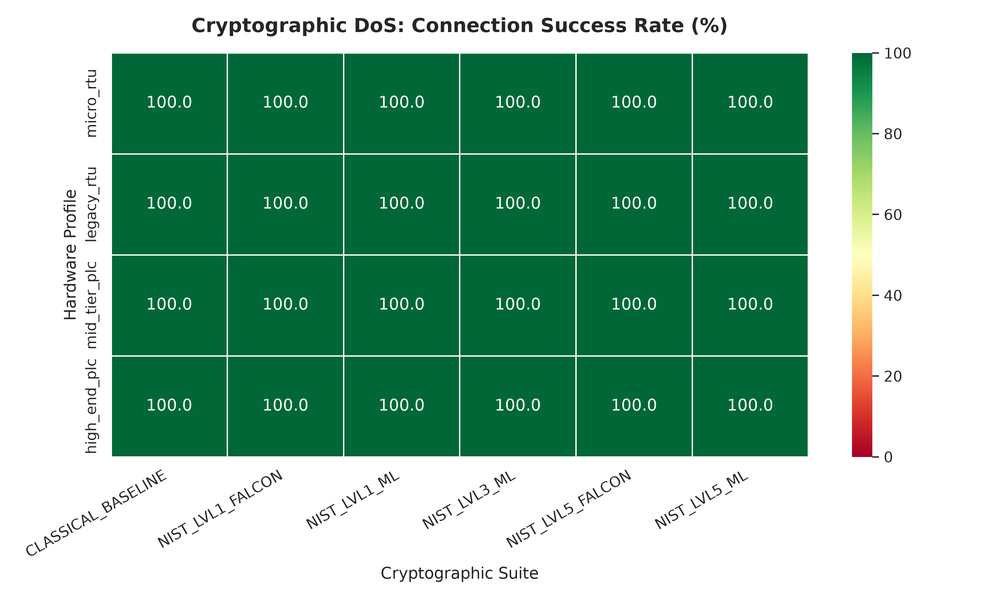</a>                                                                                                                   |
| **100% DoS Resilience:** Despite the massive packet fragmentation introduced by Level 5 Post-Quantum signatures (like ML-DSA-87, which vastly exceeds standard Ethernet MTU sizes), the connection success rate never faltered. | By enforcing strict TPKT/MBAP Application-Layer parsing and bypassing Nagle's Algorithm in the custom HMI, QUOTAS demonstrates that Cryptographic Denial-of-Service is primarily a software parsing failure, not an inherent hardware limitation. |

---

## 📂 Directory Structure

```text
QUOTAS/
├── docker-compose.yml          # Infrastructure definition & prerequisites
├── benchmark.py                # Pipeline Orchestrator (Generates 72k datapoints)
├── visualize.py                # Academic data visualization generator
├── requirements.txt            # Python dependencies (pandas, seaborn, asyncua, etc.)
├── setup.sh                    # Docker build environment script
├── index.html                  # Interactive SPA Architecture Dashboard
├── data.js                     # 72k benchmark dataset wrapper for live dashboard
├── hmi/                        # Custom HMI
│   └── hmi_multi_client.py     # Custom Python HMI telemetry multi-client
├── config/                     # OpenVPN configuration files
│   ├── openvpn-client.conf     # Client-side tunnel configuration
│   └── openvpn-server.conf     # Server-side tunnel configuration
├── scripts/                    # Helper scripts
│   └── gen_certs.sh            # OQS Certificate Generator
├── certs/                      # Folder to store certificates which are to be generated by gen_certs.sh
├── logs/                       # Directory containing execution_log.txt
│   └── execution_log.txt       # Actual execution_log.txt
├── nist_pqc_ot_benchmarks.csv  # Actual CSV generated by running the testbed
├── golden-plc-backup.tar.gz    # Golden state backup for the OpenPLC runtime
└── graphs/                     # Directory containing visualizations and the ladder logic used in golden-plc

```

---

## 🛠️ Reproduction & Setup

**Prerequisites:** Docker Engine, Python 3.11+, and standard Unix network utilities (`iproute2`, `iptables`).

> 🪟 **Windows Users (WSL 2 requirement):** Because this testbed strictly relies on Linux kernel constraints (CFS) and Unix networking to execute the throttling, Windows users **must** execute this within a **WSL-Ubuntu** environment. Ensure Docker Desktop is installed and configured to use the WSL 2 backend.

**1. Clone the Repository & Install Dependencies**
First, clone the repository and configure your Python virtual environment using the provided `requirements.txt`:

```bash
git clone https://github.com/PSaiSurya/QUOTAS.git
cd QUOTAS

# Create and activate a Python virtual environment
python3 -m venv quotas_env
source quotas_env/bin/activate

# Install all necessary python libraries
pip install -r requirements.txt
```

**2. Generate Certificates & Compile the Environment**
Before compiling the Docker images, you must generate the Open Quantum Safe (OQS) certificates required by the VPN gateways. Once generated, run the setup script to construct the infrastructure:

```bash
# Generate the cryptographic certificates for the environment
chmod +x scripts/gen_certs.sh
./scripts/gen_certs.sh

# Compile the Docker images and environment
chmod +x setup.sh
./setup.sh
```

**3. Restore the Golden PLC Environment**
To ensure the testbed executes correctly, the OpenPLC runtime requires exact database mapping for Modbus and S7comm. You must restore the pre-configured environment directly from the provided backup archive before running the benchmark:

```bash
# Load the pre-configured OpenPLC image into your local Docker daemon
docker load -i golden-plc-backup.tar.gz

# Verify the image successfully loaded (you should see 'golden-plc')
docker images | grep golden-plc
```

**4. Execute the Matrix**

_Methodology Note:_ To ensure absolute precision and avoid state contamination, the orchestration script cleanly tears down and fully reinstantiates the entire Docker infrastructure whenever a hardware profile or cipher suite changes. The environment boots unconstrained so the PQC handshake can complete normally. The dynamic Linux CFS CPU throttle (e.g., 0.1 CPU) is applied _only after_ the infrastructure is fully booted and the tunnel is established. This strictly isolates and measures the steady-state overhead.

```bash
rm -f nist_pqc_ot_benchmarks.csv
python3 benchmark.py
```

**5. Generate Visualizations**

```bash
python3 visualize.py
```

---

## 🤝 Credits & Attributions

- **Concept, Architecture & Empirical Testing:** Conceived, designed, and rigorously tested by the author.
- **Code & Dashboard Development:** The benchmark orchestration scripts, data visualization logic, and interactive live dashboard were written by **Gemini** and **Claude**.

---

_Disclaimer: QUOTAS baseline benchmarks were conducted on a single core of an Intel® Core™ i9-14900K (subject to WSL/Docker P-core/E-core abstraction limitations). Absolute hardware limits and boundary crossings will scale based on host IPC and processor architecture._
